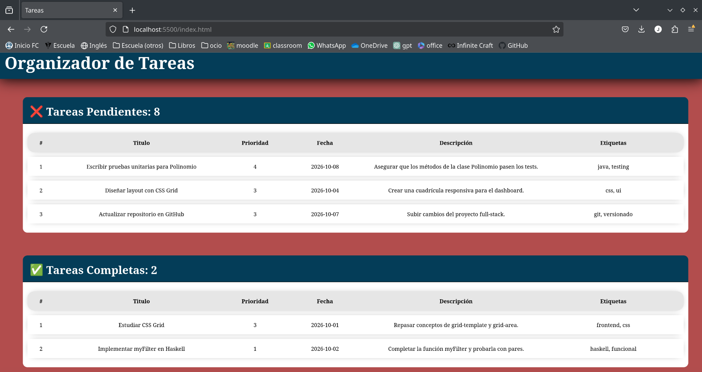

# Organizador de tareas 
Es un proyecto en donde trabajamos en equipo para crear un organizador de tareas mediante un concepto de agenda y tareas individuales, dicho proyecto lo desarrollamos con Python 3 y por ahora solo funciona desde nuestra consola/terminal

## En qué consiste el proyecto
Organizamos el proyecto con módulos y manejamos los archivos JSON para guardar datos, con esto, podemos usar la consola para:
- Agregar nuevas tareas con título, fecha, prioridad y descripción.  
- Listar tareas ordenadas por fecha, prioridad o título.  
- Buscar tareas por texto.  
- Marcar tareas como completadas.  
- Eliminar tareas.  
- Guardar y cargar tareas en formato JSON.  

## Integrantes del equipo
- Carranza Baños Jatniel
- Téllez Peña Leonardo

## Ejecución
Puedes usar el proyecto abriendo la terminal y ya una vez dentro de la carpeta del proyecto escribres: ```python agenda.py <comando> [opciones]```

Comandos disponibles:

1. add
   Agrega una nueva tarea.
   Parámetros:
     --titulo : Título de la tarea (obligatorio)
     --fecha  : Fecha de la tarea en formato YYYY-MM-DD (opcional)
     --prioridad : Prioridad de la tarea del 1 al 5 (opcional, por defecto 3)
     --etiquetas : Lista de etiquetas separadas por comas (opcional)
     --descripcion : Descripción de la tarea (opcional)
   Ejemplo:
    ```python agenda.py add --titulo "Estudiar Python" --fecha 2026-10-09 --prioridad 2 --etiquetas "programación, estudio" --descripcion "Repasar listas y diccionarios"```

2. ls
   Lista todas las tareas.
   Parámetros opcionales:
     --por : Ordenar por "fecha", "prioridad" o "titulo" (por defecto "fecha")
   Ejemplo:
     ```python agenda.py ls --por prioridad```

3. find
   Busca tareas por texto en el título o la descripción.
   Parámetro:
     texto : Palabra o frase a buscar
   Ejemplo:
     ```python agenda.py find "Python"```

4. done
   Marca una tarea como completada.
   Parámetro:
     id : ID de la tarea (por ejemplo T-0001)
   Ejemplo:
     ```python agenda.py done T-0001```

5. rm
   Elimina una tarea.
   Parámetro:
     id : ID de la tarea
   Ejemplo:
     ```python agenda.py rm T-0002```

6. Guardar y cargar tareas
   Todas las tareas se guardan automáticamente en un archivo JSON llamado Tareas.json al agregar, completar o eliminar tareas. Al iniciar la agenda, si el archivo existe, se cargan automáticamente las tareas guardadas.

## Pruebas
Para ejecutar las pruebas debes colocarte en la carpeta raíz del proyecto y ejecutas el siguiente comando:
```
PYTHONPATH=. pytest -v
```

## Exportación a html
Se puede generar un archivo index.html con todas las tareas para visualizarlas en un navegador.
Solo colocate en la raíz del proyecto y usa:
```
    python export_html.py
```
Puedes abrir el archivo html con el navegador que prefieras

## Imagen de la página

```
